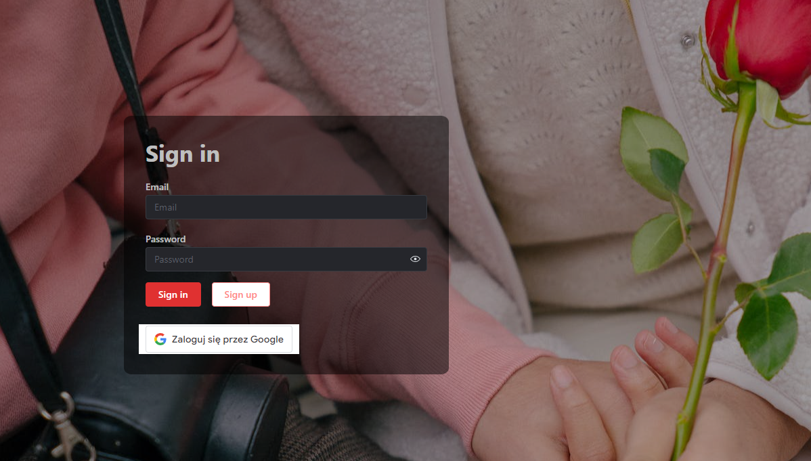
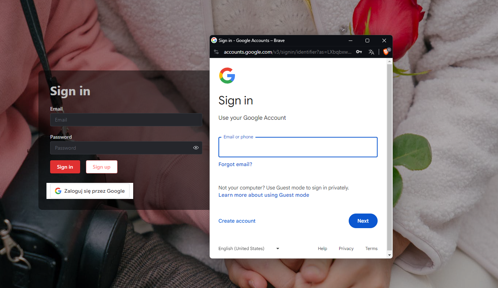

## Sign In

The Sign In page allows existing users to log into their FindHer account. Users can sign in using their email and password, or through Google OAuth.

### Sign In with Email

1. **Open the Sign In page**: Navigate to the Sign In page on the FindHer app.
2. **Enter your email and password**: Provide the email and password you used to create your account.
3. **Submit the form**: Click the "Sign In" button to access your account.

### Sign In with Google OAuth

1. **Open the Sign In page**: Navigate to the Sign In page on the FindHer app.
2. **Click the "Sign in with Google" button**: This will redirect you to the Google OAuth page.
3. **Authenticate with Google**: Enter your Google account credentials and authorize FindHer to use your Google account for sign-in.
4. **Access your FindHer account**: After successful authentication, you will be redirected back to FindHer, logged into your account.

