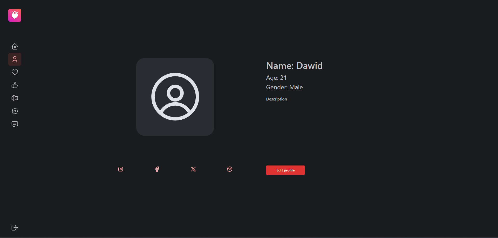

The Account route allows you to edit and display your personal information.

## Main

The `Account` component is designed to display and manage user information in a comprehensive and user-friendly manner. This component allows users to view and edit their profile details, including their avatar, personal information, and social media links.

## Edit

The account page includes an editable form where users can update their personal information. This form allows users to make changes to their name, age, gender, and description. The interface for editing is user-friendly and designed to streamline the update process, ensuring that users can easily manage their information.

1. **Open Edit Profile Dialog**: On the account page, click the "Edit Profile" button. This will open a dialog where you can update your profile details.
2. **Update Information**: In the dialog, you can update your name, age, gender, description, and profile picture. Each field is clearly labeled for ease of use.
3. **Submit Changes**: Once you have updated your information, click the "Submit" button to save your changes. Your profile will be updated immediately.

