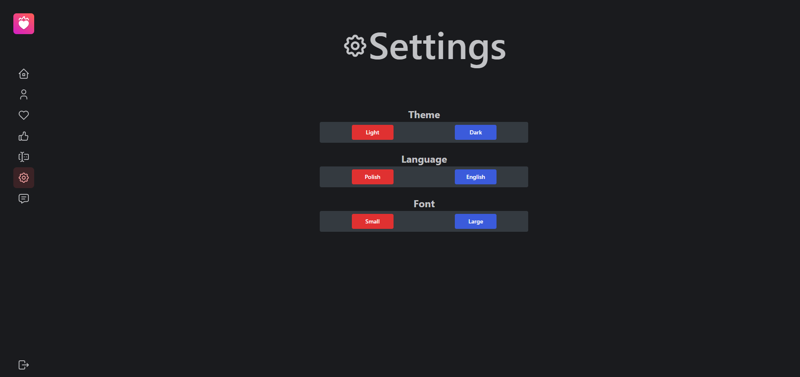

## Settings Component

The `Settings` component allows users to customize their application preferences. This includes changing the theme, language, and font size. The component is designed to be user-friendly and provides a clear and organized interface for managing settings.

### Theme Settings

Users can switch between light and dark themes to suit their preferences. This setting affects the overall appearance of the application.

**Select Theme**: Choose between the "Light" and "Dark" theme by clicking the respective buttons.

- Light Theme: Changes the application theme to light.
- Dark Theme: Changes the application theme to dark.

### Language Settings

Users can change the language of the application interface. This is useful for users who prefer to interact with the application in a different language.

**Select Language**: Choose between available languages by clicking the respective buttons.

- Polish: Changes the application language to Polish.
- English: Changes the application language to English.

### Font Size Settings

Users can adjust the font size used in the application to improve readability.

**Select Font Size**: Choose between "Small" and "Large" font sizes by clicking the respective buttons.

- Small Font: Reduces the font size for better readability in compact layouts.
- Large Font: Increases the font size for better readability.

