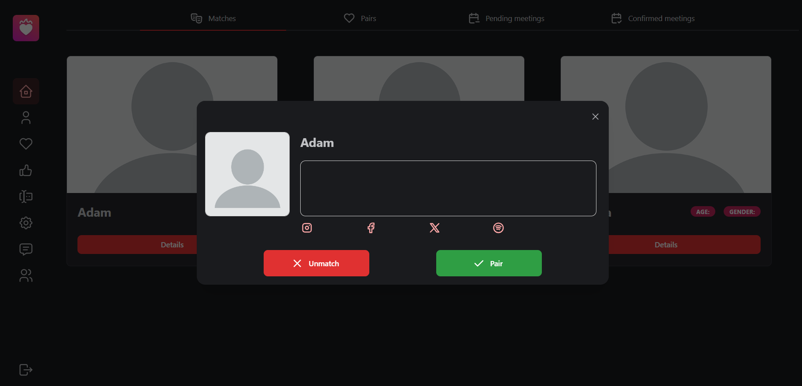

The Home route provides an entry point with four tabs to manage your connections and meetings:

- **Matches**: The Matches tab allows you to browse users you have matched with, along with basic information about them on their user cards. Each user card has a 'Details' button which, when pressed, displays a window with more information about each person, and two other buttons that let you decide whether or not you'd like to pair up with that person.
  
  In the 'Details' window, press the red 'Unmatch' button to remove selected match from your Matches, or press the green 'Pair' button to agree on pairing up with the matched person.
  

- **Pairs**: The Pairs tab displays all users you are currently paired with (both of you consented to creating a pair after being matched). From here, you can choose to break up with a person you no longer wish to see or propose a meeting with them. Both activities are available under the red padlock button and the blue 'Meeting' button respectively.
  
  After clicking on the red padlock button, a window will pop up with a question to make sure you truly wish to part ways with the selected user. You can close it to cancel the process of blocking the user, or proceed, by pressing the red button in the middle, which will result in the user no longer appearing in your pairs menu.
  
  Selecting the blue 'Meeting' button opens up a form window with input fields that need to be filled with details regarding the meeting. To create a meeting, the user has to provide a name for the meeting, specify the place at which the meeting is to take place, and lastly propose a date and time for the meeting.
  

- **Pending Meetings**: The Pending Meetings tab shows a list of meetings that have been proposed, but not yet confirmed nor denied. If you have created a meeting, it will be displayed here, showing the details of the proposed meeting.
  
  If you are the one receiving a proposition, the meeting tile will have two buttons, allowing you to reject or accept the offer. Upon rejection, the meeting will be removed, while accepting it, will move the specified meeting to the Confirmed Meetings tab.
  

- **Confirmed Meetings**: Finally, the Confirmed Meetings tab shows a list of meetings that have been agreed upon by both parties involved in them. Each meeting will disappear after the time specified during its creation process had passed.
  
