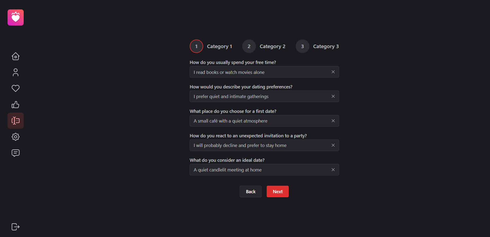
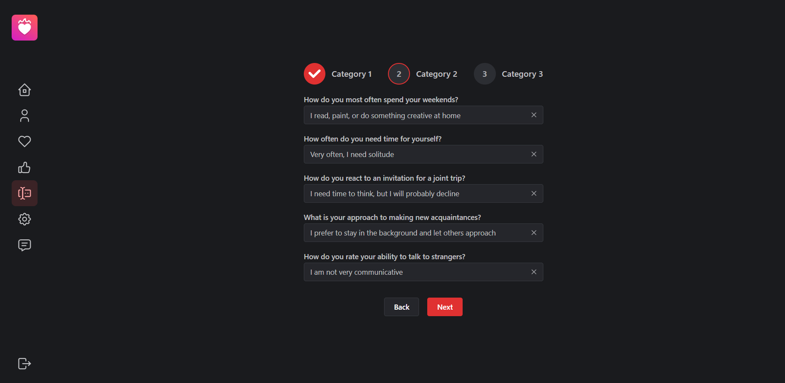
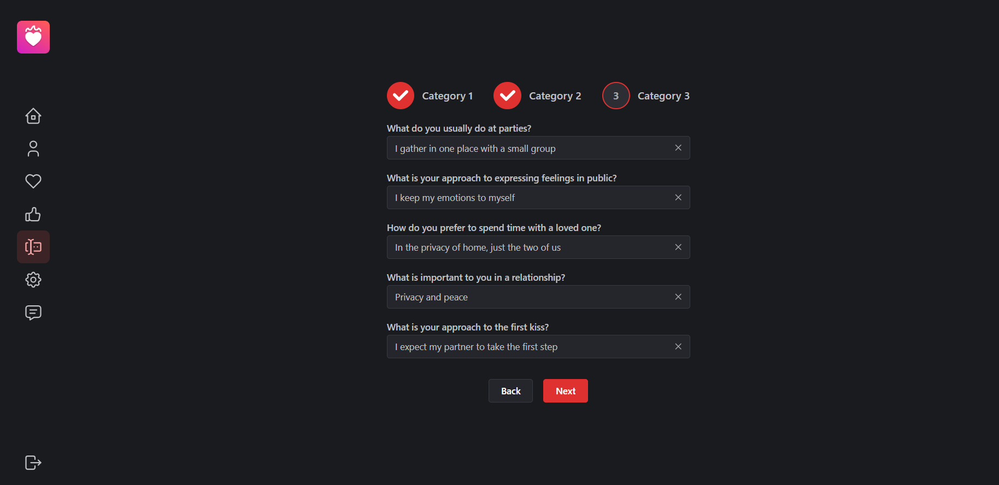
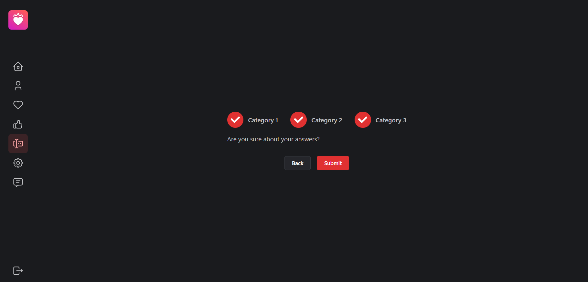

The Matchform route takes the user to a form, that is used to determine what kind of a person they are, to help them match with compatible users. To fill out the form, the user needs to select an answer to each question from a dropdown list, and press the 'Next' button below the selection fields. If the user wishes to change one of their previous answers to one or more questions, they simply need to press the 'Back' button and make another selection from an appropriate field.

After selecting the answers to all of the questions, the user is asked whether or not they are ready to submit their form. If they are, they can press the 'Submit' button to do so, and if not, they can press the 'Back' button to go back to the previous steps of the form.

