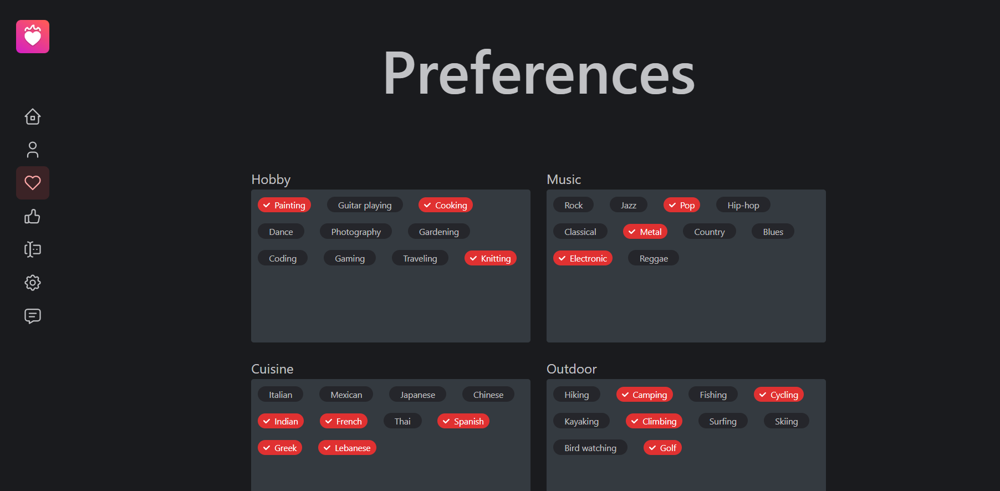
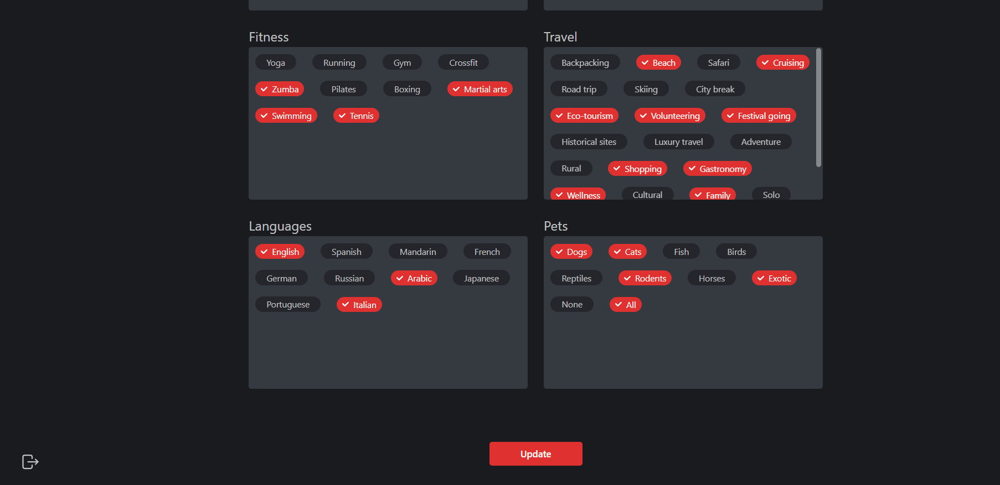

The Preferences route allows you to set your preferences as to the interests of your potential match. Preferences available for selection are divided into few categories as evidenced by boxes surrounding the buttons. To select a preference, simply click on its name. Your selection will be visualised by the selected preference's name button changing its color.

After selecting all preferences you wish to select, press the 'Update' button at the bottom of the page to save your selection and assign it to your profile.

