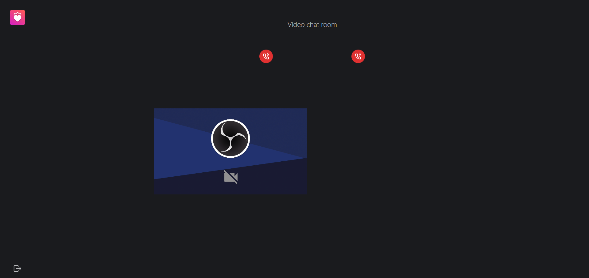

The Chat route allows you to communicate with users you are currently paired with. People available to chat with are listed on the left side of the screen. The right side displays the history of the conversation so far. To send a new message, type it in the input field at the bottom and press the Enter key on your keyboard or the 'Send' button next to the message input field.

Above the message history panel, there is an icon with a picture of a camera. If both users press that icon, they will be able to talk to each other using videochat instead of typing messages. To end a videochat session, click the 'Disconnect' button in the top section of the screen. That will return you to the regular chat screen.

